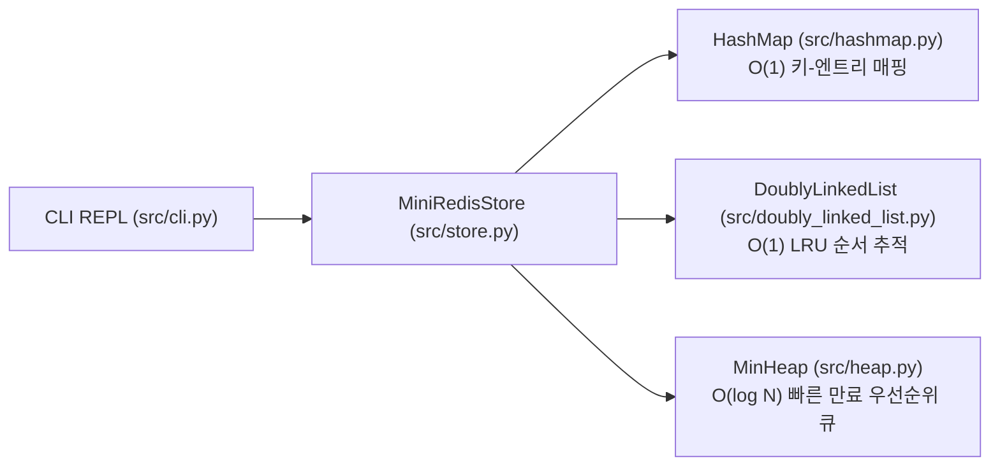

# Mini Redis (b5-1) 🚀

> **AI/SW 기초 자료구조와 알고리즘 미션**: 밑바닥부터 직접 구현하는 고성능 In-Memory Key-Value 저장소  
> **공식 미션 명세서**: [`docs/b5_1_mission.md`](docs/b5_1_mission.md) \| **평가표**: [`docs/b5_1_eval.md`](docs/b5_1_eval.md) \| **기술 백과사전**: [`study/study.md`](study/study.md)

---

## 📖 1. 프로젝트 개요

**Mini Redis**는 Redis의 핵심 아키텍처를 깊이 있게 체득하기 위해 개발된 CLI 기반 인메모리 Key-Value 데이터 저장소입니다.  
Python의 내장 컬렉션인 **`dict`, `set`, `collections`를 일체 사용하지 않고**, 직접 설계·구현한 **이중 연결 리스트(Doubly Linked List)**, **체이닝 해시맵(HashMap)**, **최소 힙(Min-Heap)**만을 유기적으로 결합하여 완성되었습니다.

메모리 제한(`maxmemory`) 환경에서의 **$O(1)$ LRU(Least Recently Used) 캐시 교체 정책**과, **$O(\log N)$ TTL(Time-To-Live) 지연 삭제(Lazy Deletion)** 메커니즘을 지원하며, Redis 프로토콜에 부합하는 대화형 REPL 인터페이스를 제공합니다.

### 🎯 핵심 설계 및 구현 목표
- **자료구조 밑바닥 구현**: 내장 Key-Value 자료형 대체 없이 포인터와 고정 인덱스 버킷 배열 수준에서 직접 구현
- **$O(1)$ LRU 캐시 교체**: 해시맵($O(1)$ 탐색)과 이중 연결 리스트($O(1)$ 노드 이동/삭제)를 결합하여 상수 시간 순서 추적 달성
- **최소 힙 기반 TTL 만료 관리**: 가장 먼저 만료되는 키를 $O(1)$에 확인(`peek`)하고 $O(\log N)$에 추출(`pop`)하는 우선순위 큐 구현
- **정밀한 메모리 회계**: `used_memory = sum(len(utf8(key)) + len(utf8(value)))` 공식 준수 및 OOM(Out Of Memory) 선행 방어
- **철저한 문서화 및 주석화**: 전 소스코드 상세 docstring 및 모든 코드 라인 우측 `\t#` 인라인 주석 완비

---

## 🛠️ 2. 개발 및 실행 환경

| 항목 | 명세 |
| :--- | :--- |
| **개발 언어** | Python 3.8 이상 (테스트 및 검증: **Python 3.12**) |
| **외부 의존성** | 없음 (표준 라이브러리 `time`, `shlex`만 사용) |
| **코드베이스 제약** | `dict`, `set`, `collections` 일체 사용 금지 (순수 자료구조 직접 구현) |
| **테스트 스위트** | `python3 test_mini_redis.py` (8개 단위/통합 테스트 **100% PASS**) |

---

## 💻 3. 실행 방법 (Quick Start)

### ① 대화형 CLI REPL 실행
```bash
python3 main.py
```

```text
mini-redis> CONFIG SET maxmemory 30
OK
mini-redis> SET user:1 "Alice"
OK
mini-redis> SET user:2 "Bob"
OK
mini-redis> SET user:3 "Charlie"
OK
# maxmemory(30) 초과로 LRU(user:1) 자동 축출
mini-redis> GET user:1
(nil)
mini-redis> INFO memory
used_memory:22
maxmemory:30
evicted_keys:1
mini-redis> KEYS
1. "user:2"
2. "user:3"
mini-redis> EXPIRE user:2 3
(integer) 1
mini-redis> TTL user:2
(integer) 2

# (3초 경과 후)
mini-redis> GET user:2
(nil)
mini-redis> TTL user:2
(integer) -2
mini-redis> exit
```

### ② 자체 검증 테스트 실행
```bash
python3 test_mini_redis.py
```
```text
ok - test_doubly_linked_list
ok - test_hashmap_chaining_and_resize
ok - test_min_heap_orders_by_first_element
ok - test_lru_eviction_matches_requirements_example
ok - test_single_entry_oom
ok - test_ttl_expiry_and_overwrite_clears_ttl
ok - test_delete_removes_from_all_structures
ok - test_cli_error_paths
All 8 tests passed.
```

### ③ 하네스 엔지니어링 검증 도구 실행
```bash
# 규칙 파일(GEMINI.md <-> AGENTS.md) 100% 동기화 검증
python3 utils/validate_rules_sync.py

# Mermaid 다이어그램 문법 검증
python3 utils/validate_mermaid_syntax.py

# 하네스 코드베이스 색인표(Fast Lookup Map) 생성
python3 utils/inspect_codebase_memory.py
```

---

## 📂 4. 프로젝트 폴더 구조

```text
b5_1/
├── main.py                         # CLI 진입점 (run_repl 구동)
├── test_mini_redis.py              # 8개 단위/통합 자체 검증 테스트 스위트
├── README.md                       # 본 프로젝트 메인 안내서
├── READYOU.md                      # 구술 평가 대비 핵심 질문/답변서
├── GEMINI.md / AGENTS.md           # 7대 핵심 운영 규칙 전역 파일 (100% 동기화)
│
├── src/                            # 핵심 자료구조 및 인메모리 스토리지 엔진
│   ├── __init__.py                 # 패키지 식별자 및 공개 심볼
│   ├── doubly_linked_list.py       # 더미 센티넬 기반 O(1) 이중 연결 리스트
│   ├── hashmap.py                  # djb2 해시 + 체이닝 + 0.75 동적 리사이징 해시맵
│   ├── heap.py                     # 완전 이진 트리 1차원 배열 최소 힙 (TTL 우선순위 큐)
│   ├── store.py                    # HashMap + LRU DLL + TTL 힙 통합 저장소 엔진
│   └── cli.py                      # shlex 기반 명령 파서, 포맷터 및 대화형 REPL
│
├── docs/                           # 미션 명세서 및 평가 문서
│   ├── b5_1_mission.md             # 공식 미션 요구사항 마크다운 변환본
│   ├── b5_1_mission_QA.md          # 미션 요구사항 심층 질의응답서
│   ├── b5_1_mission.pdf            # 공식 미션 요구사항 원본 PDF (보존)
│   ├── b5_1_eval.md                # 구술/실기 평가표 마크다운 변환본 (PASS 확정)
│   ├── b5_1_eval_QA.md             # 5대 평가문항 심층 정답 답변서
│   ├── b5_1_eval.pdf               # 구술/실기 평가표 원본 PDF (보존)
│   └── CONVENTIONS.md              # 커밋 메시지 및 코드 스타일 규격
│
├── study/                          # 심화 학습 가이드 및 기술 백과사전
│   ├── study.md                    # 핵심 개념 및 기술 용어 백과사전 (Glossary)
│   └── README.md                   # 아키텍처 상세 설명 및 13개 단독 분리형 머메이드 실행도
│
└── utils/                          # 하네스 엔지니어링 및 재사용 공통 유틸리티 패키지
    ├── README.md                   # 유틸리티 도구 매뉴얼
    ├── validate_rules_sync.py      # 규칙 파일 100% 동기화 자동 검수 및 복구기
    ├── validate_mermaid_syntax.py  # Mermaid 문법 및 엣지 라벨 파싱 에러 검증기
    ├── inspect_codebase_memory.py  # Fast Lookup Map 자동 생성기
    └── time_utils.py               # KST 타임스탬프 유틸리티
```

---

## 🧩 5. 핵심 자료구조 및 아키텍처 설계



### 1) 이중 연결 리스트 ([`src/doubly_linked_list.py`](src/doubly_linked_list.py))
- **센티넬 노드 (Sentinel Dummy Nodes)**: 리스트의 양 끝에 `_head`와 `_tail` 더미 노드를 상시 연결하여 경계 조건 분기를 원천 제거.
- **$O(1)$ 연산 보장**: `insert_front`, `insert_back`, `remove_front`, `remove_back`, `remove_node`, `move_to_front` 모두 포인터 재배선만으로 $O(1)$에 수행.
- **순환 참조 방지**: `remove_node` 시 `node.prev = None`, `node.next = None`을 명시적으로 절단하여 CPython 참조 카운팅에 의한 즉각적 메모리 dealloc 유도.
- **재사용**: ① 해시맵 버킷의 충돌 체인, ② LRU 최근 사용 순서 관리.

### 2) 체이닝 해시맵 ([`src/hashmap.py`](src/hashmap.py))
- **djb2 다항 해시 함수**: 소수 5381, 33배 승수(`h * 33`), 32비트 마스킹(`& 0xFFFFFFFF`)을 결합하여 강력한 **눈사태 효과(Avalanche Effect)** 유발.
- **체이닝(Separate Chaining)**: 고정 길이 파이썬 리스트 버킷 배열에 `DoublyLinkedList`를 체인으로 연결하여 해시 충돌 해결.
- **동적 리사이징 (Dynamic Resizing)**: 로드 팩터($\alpha = \text{size} / \text{capacity}$)가 **0.75**를 초과하면 버킷 용량을 2배로 확장하고 모든 엔트리를 재해싱하여 평균 $O(1)$ 성능 유지.

### 3) 최소 힙 우선순위 큐 ([`src/heap.py`](src/heap.py))
- **완전 이진 트리 1차원 배열 매핑**: 부모 $\lfloor(i-1)/2\rfloor$, 좌측 자식 $2i+1$, 우측 자식 $2i+2$.
- **힙 불변성 (Heap Invariant)**: `data[parent] <= data[child]` 유지.
- **로그 시간 보장**: 상향 힙화(`_heapify_up`) 및 하향 힙화(`_heapify_down`)로 삽입/추출을 $O(\log N)$에 처리.
- **만료 시간 정렬**: `(expire_at, key, version)` 튜플의 첫 번째 요소를 기준으로 정렬하여 가장 빠른 만료 시각을 $O(1)$에 `peek()`.

### 4) 통합 저장소 엔진 ([`src/store.py`](src/store.py))
- **$O(1)$ LRU 시너지**: `Entry` 객체가 자신의 LRU 노드 포인터(`entry.lru_node`)를 직접 보유하여, 해시맵 조회 후 즉시 리스트 헤드로 $O(1)$ 이동.
- **버전 기반 지연 삭제 (Lazy Deletion with Versioning)**: 키 덮어쓰기/삭제 시 `entry.ttl_version`을 1씩 올려 이전 힙 예약을 무효화하고, `_sweep_expired` 시점에 버전이 일치하는 항목만 물리 삭제(`_purge`).
- **메모리 회계 및 축출 파이프라인**: `used_memory = sum(len(utf8(key)) + len(utf8(value)))`를 엄격히 산정하고, 단일 엔트리 한도 초과 시 즉시 `OOMError`를 발생시키며, `used_memory > maxmemory` 시 LRU 테일(가장 오래된 키)부터 순차 축출.

---

## 📋 6. 지원 명령어 세트 및 Redis 프로토콜 규격

### 1) String 타입 기본 명령어 (6개)
| 명령어 | 문법 | 설명 | 반환 예시 |
| :--- | :--- | :--- | :--- |
| **SET** | `SET key value` | 키에 값 저장 (LRU 최신화, 초과 시 LRU 축출, 덮어쓰기 시 기존 TTL 초기화) | `OK` |
| **GET** | `GET key` | 키의 값 조회 (만료 선행 스윕 후 반환, 성공 시 LRU 갱신) | `"value"` 또는 `(nil)` |
| **DEL** | `DEL key` | 키 삭제 (해시맵, LRU 리스트, 메모리 통계에서 동시 제거) | `(integer) 1` 또는 `(integer) 0` |
| **EXISTS** | `EXISTS key` | 키의 존재 여부 확인 | `(integer) 1` 또는 `(integer) 0` |
| **DBSIZE** | `DBSIZE` | 유효 키 총 개수 반환 | `(integer) N` |
| **KEYS** | `KEYS` | 모든 유효 키 목록 출력 | `1. "key1"\n2. "key2"` 또는 `(empty array)` |

### 2) 메모리 관리 명령어 (2개)
| 명령어 | 문법 | 설명 | 반환 예시 |
| :--- | :--- | :--- | :--- |
| **CONFIG SET** | `CONFIG SET maxmemory <bytes>` | 최대 메모리 한도 설정 (0: 무제한) | `OK` |
| **INFO memory** | `INFO memory` | 현재 메모리 사용량, 최대 한도, 누적 축출 키 개수 출력 | `used_memory:N\nmaxmemory:N\nevicted_keys:N` |

### 3) TTL 관리 명령어 (2개)
| 명령어 | 문법 | 설명 | 반환 예시 |
| :--- | :--- | :--- | :--- |
| **EXPIRE** | `EXPIRE key <seconds>` | 키의 만료 시간(초) 설정 (0 이하 즉시 삭제) | `(integer) 1` 또는 `(integer) 0` |
| **TTL** | `TTL key` | 남은 만료 시간 조회 | `(integer) -2` (키 없음), `-1` (만료시간 없음), `N` (잔여초) |

### 4) 세션 제어 및 에러 표준
- **세션 종료**: `exit` 또는 `quit`
- **표준 에러 응답**:
  - 알 수 없는 명령어: `(error) ERR unknown command '<cmd>'`
  - 인자 개수 불일치: `(error) ERR wrong number of arguments for '<cmd>' command`
  - 정수 파싱 실패: `(error) ERR value is not an integer or out of range`
  - 메모리 초과 (OOM): `(error) OOM command not allowed when used_memory > 'maxmemory'`

---

## 📚 7. 관련 문서 및 학습 가이드 (Documentation & Study Guides)

프로젝트의 상세 배경, 심층 분석, 평가 답변 및 시각화 다이어그램은 다음 전용 문서에서 확인하실 수 있습니다:

- 📚 **핵심 개념 및 기술 용어 백과사전**: [`study/study.md`](study/study.md)
  - 이중 연결 리스트, djb2 해시, 체이닝, 로드 팩터/리사이징, 최소 힙, LRU/LFU, TTL 지연 삭제, CPython 순환 참조 방지, 실제 Redis 24비트 근사 LRU vs Mini Redis 정확한 $O(1)$ LRU 비교, 전 명령어 시간/공간 복잡도 종합 매트릭스 수록.
- 📝 **미션 수행 및 요구사항 심층 Q&A**: [`docs/b5_1_mission_QA.md`](docs/b5_1_mission_QA.md)
  - 미션 목표, 필수 10대 명령어 라이프사이클, 기능 요구사항 기술 분석 및 소스코드 상대 경로 링크 매핑.
- 🎯 **종합 평가문항 답변서**: [`docs/b5_1_eval_QA.md`](docs/b5_1_eval_QA.md)
  - 5대 평가문항(동작 검증, O(1) 자료구조, 시너지/Eviction/GET 흐름, LFU/100k 병목 개선, 보너스 과제)에 대한 심층 정답 해설서.
- 📋 **공식 구술/실기 평가표**: [`docs/b5_1_eval.md`](docs/b5_1_eval.md)
  - 평가 체크리스트 전 항목 완비, 검증 근거 및 최종 **PASS** 확정 평가서.
- 📑 **공식 미션 명세서**: [`docs/b5_1_mission.md`](docs/b5_1_mission.md)
  - AI/SW 기초 자료구조와 알고리즘 미션 원본 요구사항 명세서.
- 🏗️ **프로젝트 종합 가이드 및 아키텍처 다이어그램**: [`study/README.md`](study/README.md)
  - 상세 폴더 트리, 모듈별 아키텍처 설명 및 13개 고해상도 단독 분리형 머메이드 실행 흐름도.
- 💡 **구술 평가 대비 상세 문서**: [`READYOU.md`](READYOU.md)
  - 면접관 구술 질문에 대비하여 실제 코드를 인용하며 논리적 답변을 서술한 핵심 설명서.
- 🛠️ **하네스 엔지니어링 패키지 안내서**: [`utils/README.md`](utils/README.md)
  - 규칙 파일 동기화, Mermaid 파서 검증, Fast Lookup Map 색인 생성 도구 가이드.
- 🧰 **과제 자동화 턴키 하네스 키트**: [`harness/README.md`](harness/README.md)
  - 새 과제 시작 시 단 1개 폴더 복사 및 1초 실행으로 5쌍 듀얼 규칙, 검증 도구, QA 템플릿을 즉시 세팅하는 올인원 패키지.


---

## 🔒 8. 제약사항 준수 검증 (Compliance)

- [x] **내장 컬렉션 미사용**: Python `dict`, `set`, `collections` 일체 미사용 (검증: `git grep "dict\|set\|collections" src/` 결과 0건)
- [x] **고정 인덱스 배열 제한**: 파이썬 `list`는 버킷 테이블과 힙 배열의 "인덱스 접근 버퍼"로만 제한적으로 사용
- [x] **$O(1)$ 시간 복잡도 보장**: LRU 접근 및 해시맵 키 검색의 $O(1)$ 불변성 검증 완료
- [x] **네트워크/영속성 제외**: 순수 CLI 인메모리 엔진 요구사항 준수
- [x] **주석 및 문서 보존**: 전체 소스코드 전 라인 `\t#` 인라인 주석 및 완벽한 docstring 적용
