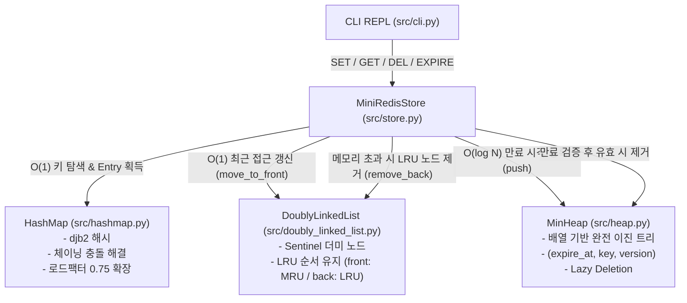

# Mini Redis 프로젝트 종합 가이드 (Overview, Details & Architecture)

본 문서는 `b5_1` (CLI 기반 Mini Redis) 프로젝트의 개요, 상세 구현 원리, 구현된 기능 목록, 전체 폴더 트리 구조 및 각 파일의 역할과 아키텍처를 종합적으로 정리한 완전 가이드입니다.

---

## 📌 1. 프로젝트 개요 (Project Overview)

- **과제명**: 정보를 엄청 빠르게 찾아주는 작은 저장소 만들기 (CLI 기반 Mini Redis)
- **분야 및 학습 주제**: AI/SW 기초 / 자료구조와 알고리즘 (Data Structures & Algorithms)
- **개발 환경 및 언어**:
  - Python 3.8 이상 권장 (Python 3.12 테스트 검증 완료)
  - 외부 라이브러리 의존성 없음 (순수 Python 표준 라이브러리 `time`, `shlex`만 사용)
- **프로젝트 핵심 목표**:
  - Redis가 왜 빠른지 밑바닥부터 핵심 자료구조를 직접 구현하며 동작 원리를 깊이 이해.
  - Python 내장 컬렉션(`dict`, `set`, `collections`)을 일체 사용하지 않고, 수작업으로 구현한 **이중 연결 리스트(Doubly Linked List)**, **체이닝 해시맵(HashMap)**, **최소 힙(Min-Heap)**을 유기적으로 조합하여 **$O(1)$ LRU 캐시 제거** 및 **$O(\log N)$ TTL 만료 관리**가 완벽히 동작하는 경량 인메모리 Key-Value 데이터 저장소를 완성.

---

## 🔍 2. 프로젝트 상세 (Project Details)

### 2.1 엄격한 자료구조 제약 사항
- 학습 목적의 핵심 제약에 따라 Python 내장 해시 컬렉션인 `dict`, `set` 및 `collections` 모듈의 사용이 일체 금지됩니다.
- 버킷 배열 및 힙 내부 저장소로 쓰이는 Python `list`는 고정 인덱스 접근(`list[i]`) 및 배열 확장 목적의 "저수준 연속 메모리 버퍼"로만 제한적으로 사용됩니다.
- 해시 계산, 충돌 해결(체이닝), 리사이즈, 노드 포인터 조작, 힙 정렬/재배치, LRU 순서 갱신, TTL 만료 추적 등 핵심 로직은 100% 직접 구현되었습니다.

### 2.2 3대 핵심 자료구조 설계 원리
1. **Sentinel 기반 이중 연결 리스트 (`DoublyLinkedList`)**:
   - 머리(head)와 꼬리(tail)에 더미(Sentinel) 노드를 배치하여 빈 리스트나 단일 노드일 때의 None 예외 분기 처리를 제거.
   - 노드 포인터(`prev`, `next`) 조작만으로 `insert_front`, `insert_back`, `remove_front`, `remove_back`, `remove_node`, `move_to_front`가 모두 순수 **$O(1)$**로 수행.
   - 해시맵의 버킷 충돌 체인과 스토어의 LRU 순서 큐(MRU=front, LRU=back)로 다목적 재사용.
2. **djb2 체이닝 해시맵 (`HashMap`)**:
   - `djb2` 다항 해시 알고리즘(`h = ((h * 33) + ord(ch)) & 0xFFFFFFFF`)을 적용하여 32비트 정수 공간에서 키를 균일하게 분산.
   - 충돌 발생 시 해당 버킷 인덱스의 `DoublyLinkedList`에 `_Pair(key, value)` 노드를 체이닝하여 충돌을 안전하게 해결.
   - 로드 팩터($\text{size} / \text{capacity}$)가 **0.75를 초과하는 즉시 버킷 수를 2배로 확장하고 전체 원소를 재해싱**하여 평균 **$O(1)$** 조회/삽입 성능 유지.
3. **배열 기반 최소 힙 (`MinHeap`)**:
   - 완전 이진 트리를 1차원 배열(`list`)로 표현 (부모: `(i-1)//2`, 좌측 자식: `2i+1`, 우측 자식: `2i+2`).
   - `(expire_at, key, version)` 튜플을 첫 번째 원소인 만료 시각(`expire_at`) 기준으로 자동 최소 정렬.
   - `push`와 `pop` 시 `_heapify_up`, `_heapify_down`을 통해 **$O(\log N)$**의 시간 복잡도로 가장 빠른 만료 시각을 즉각 추적.

### 2.3 조립 계층 및 복합 스토리지 엔진 (`MiniRedisStore`)
- **$O(1)$ LRU 갱신 원리**: `HashMap` 조회로 얻은 `_Entry`가 자신의 리스트 노드(`lru_node`) 포인터를 직접 보유하여, 조회 즉시 $O(1)$로 리스트 헤드로 이동(`move_to_front`).
- **Lazy Deletion TTL 원리**: 힙 내부의 원소를 임의 검색하여 삭제하는 비용($O(N)$)을 방지하기 위해 `ttl_version` 카운터를 활용. 키 덮어쓰기나 삭제 시 버전을 1 증가시켜 기존 힙 원소를 논리적으로 무효화하고, 만료 검사 시 버전이 일치하는 항목만 실제 삭제 처리.
- **메모리 제한 및 Eviction 흐름**:
  - 메모리 사용량 공식: $\text{used\_memory} = \sum (\text{len}(\text{utf8}(key)) + \text{len}(\text{utf8}(value)))$ (자료구조 노드/포인터 오버헤드 제외).
  - 단일 키+값 크기가 `maxmemory`를 초과하면 데이터를 저장하지 않고 즉시 OOM 에러 출력.
  - `SET` 후 `used_memory > maxmemory`인 경우, `DoublyLinkedList.remove_back()`을 통해 가장 오래 미사용된 키(LRU)부터 `used_memory <= maxmemory`가 될 때까지 순차 제거하며 `evicted_keys` 카운트 증가.

---

## ⚡ 3. 구현 기능 목록 (Implemented Features)

### ① String 타입 기본 명령어 (6개)
| 명령어 | 주요 기능 및 동작 규칙 | 시간 복잡도 | 출력 형식 |
| :--- | :--- | :--- | :--- |
| `SET key value` | 키-값 저장. 만료 확인, 기존 TTL 초기화, 메모리 초과 시 LRU 제거, LRU 갱신 | 평균 $O(1)$ | `OK` |
| `GET key` | 키 값 조회. 만료된 키는 삭제 후 `(nil)` 처리. 성공 시에만 LRU front 이동 | 평균 $O(1)$ | `"value"` 또는 `(nil)` |
| `DEL key` | 키 삭제. 데이터 저장소, LRU 연결 리스트, TTL 관리 구조 모두에서 완전 제거 | 평균 $O(1)$ | `(integer) 1` (존재) <br> `(integer) 0` (미존재) |
| `EXISTS key` | 키 존재 여부 확인 (만료 키 사전 검사 후 처리) | 평균 $O(1)$ | `(integer) 1` / `(integer) 0` |
| `DBSIZE` | 현재 저장된 총 유효 키 개수 반환 | $O(1)$ | `(integer) N` |
| `KEYS` | 현재 저장된 전체 유효 키 목록을 배열 번호 매김 형태로 출력 | $O(N)$ | `1. "user:2"` <br> `2. "user:3"` |

### ② 메모리 관리 명령어 (2개)
| 명령어 | 주요 기능 및 동작 규칙 | 출력 형식 |
| :--- | :--- | :--- |
| `CONFIG SET maxmemory bytes` | 최대 메모리 제한 설정 (바이트 단위, 0은 무제한 간주). 음수/비정수 검증 | `OK` |
| `INFO memory` | 현재 메모리 사용량, 최대 제한, LRU 제거된 키 개수 출력 | `used_memory:<num> maxmemory:<num> evicted_keys:<num>` |

### ③ TTL 관리 명령어 (2개)
| 명령어 | 주요 기능 및 동작 규칙 | 출력 형식 |
| :--- | :--- | :--- |
| `EXPIRE key seconds` | 키의 만료 시간 설정 (초 단위). 0 이하 시 즉시 만료 처리. 없는 키는 0 반환 | `(integer) 1` (성공) <br> `(integer) 0` (실패) |
| `TTL key` | 키의 남은 만료 시간 조회 | 키 없음: `(integer) -2` <br> TTL 없음: `(integer) -1` <br> 남은 초: `(integer) N` |

### ④ 대화형 CLI REPL 인터페이스
- `mini-redis>` 프롬프트 제공 및 대화형 명령어 실행 루프.
- `shlex` 라이브러리를 활용한 큰따옴표 감싼 값(예: `"Alice Bob"`) 및 공백 파싱.
- 대소문자 무관 명령어 처리 (`SET`, `set`, `Set`).
- `exit` 또는 `quit` 입력 시 세션 정상 종료.
- Redis 표준 규격 에러 출력:
  - 잘못된 명령: `(error) ERR unknown command '<cmd>'`
  - 인자 개수 불일치: `(error) ERR wrong number of arguments for '<cmd>' command`
  - 정수 파싱 오류: `(error) ERR value is not an integer or out of range`
  - 단일 항목 메모리 초과: `(error) OOM command not allowed when used_memory > 'maxmemory'`

---

## 4. 전체 프로젝트 폴더 트리 (Folder Tree)

```
b5_1/
├── AGENTS.md                   # 프로젝트 전역 에이전트 행동 지침 (GEMINI.md와 100% 동기화)
├── GEMINI.md                   # 프로젝트 전역 에이전트 행동 지침 (AGENTS.md와 100% 동기화)
├── README.md                   # 프로젝트 메인 안내서 (실행 방법, 자료구조 설계 개요)
├── READYOU.md                  # 구술 평가(인터뷰) 대비 핵심 원리 심층 설명서
├── main.py                     # CLI 애플리케이션 진입점 (엔트리 포인트)
├── test_mini_redis.py          # 8대 핵심 기능 자체 검증 테스트 스위트
├── .gitignore                  # OS 및 파이썬 캐시 제외 설정
│
├── src/                        # 핵심 스토리지 엔진 및 직접 구현한 자료구조 모듈
│   ├── __init__.py             # 패키지 식별자
│   ├── AGENTS.md               # src 모듈 전용 규칙 파일
│   ├── GEMINI.md               # src 모듈 전용 규칙 파일
│   ├── cli.py                  # Redis 호환 CLI REPL 및 명령어 파서/포매터
│   ├── doubly_linked_list.py   # Sentinel 기반 양방향 연결 리스트 (O(1) 연산)
│   ├── hashmap.py              # djb2 체이닝 해시맵 (0.75 로드팩터 리사이즈)
│   ├── heap.py                 # 배열 기반 최소 힙 (TTL 만료 관리용)
│   └── store.py                # 3개 자료구조를 조합한 통합 인메모리 저장소 (LRU + TTL)
│
├── docs/                       # 공식 과제 명세, 평가 기준서 및 개발 컨벤션
│   ├── AGENTS.md               # docs 전용 규칙 파일
│   ├── GEMINI.md               # docs 전용 규칙 파일
│   ├── CONVENTIONS.md          # Git 커밋 메시지 및 코드 스타일 컨벤션
│   ├── b5_1_mission.md         # 미션 요구사항 마크다운 변환본
│   ├── b5_1_mission.pdf        # 원본 미션 요구사항 PDF (보존)
│   ├── b5_2_Redis_eval.md      # 구술/실기 평가표 마크다운 변환본
│   └── b5_2_Redis_eval.pdf     # 원본 구술/실기 평가표 PDF (보존)
│
└── study/                      # 프로젝트 구조 및 학습 가이드 디렉터리
    ├── AGENTS.md               # study 전용 규칙 파일
    ├── GEMINI.md               # study 전용 규칙 파일
    └── README.md               # 본 문서 (프로젝트 개요, 상세, 구현기능, 폴더 트리 종합)
```

---

## 5. 파일별 상세 개요 및 아키텍처 분석

### 5.1 루트 실행 및 테스트 파일

#### [main.py](file:///Users/mpeg46551/b5_1/main.py)
- **역할**: CLI 애플리케이션 진입점.
- **주요 로직**:
  - `src.cli` 모듈의 `run_repl()` 함수를 호출.
  - 대화형 쉘 환경(`mini-redis>`)을 시작하여 사용자 입력을 받아 명령어를 실행하고 결과를 출력.

#### [test_mini_redis.py](file:///Users/mpeg46551/b5_1/test_mini_redis.py)
- **역할**: 외부 테스트 라이브러리 없이 순수 `assert` 기반으로 작성된 통합/단위 테스트 스위트.
- **8대 검증 항목**:
  1. `test_doubly_linked_list`: 노드 앞/뒤 삽입, 삭제, 앞으로 이동(`move_to_front`)의 $O(1)$ 동작 및 이터레이션 검증.
  2. `test_hashmap_chaining_and_resize`: 체이닝 충돌 해결 및 50개 키 삽입 시 로드팩터 0.75 기준 2배 확장(재해싱) 검증.
  3. `test_min_heap_orders_by_first_element`: 튜플의 첫 번째 요소(`expire_at`) 기준 최소 힙 정렬과 `peek`/`pop` 순서 검증.
  4. `test_lru_eviction_matches_requirements_example`: `maxmemory 30` 설정 시 3개 키 삽입 후 메모리 초과로 가장 오래된 키(`user:1`)가 자동 제거되는 예제 시나리오 검증.
  5. `test_single_entry_oom`: 단일 키+값의 UTF-8 바이트 크기 자체가 `maxmemory`를 초과할 경우 저장되지 않고 OOM 에러가 발생하는지 검증.
  6. `test_ttl_expiry_and_overwrite_clears_ttl`: 키 만료 시 자동 제거(`(nil)` 반환, TTL `-2`), 기존 키를 `SET`으로 덮어쓸 때 기존 TTL이 초기화되는지 검증.
  7. `test_delete_removes_from_all_structures`: `DEL` 호출 시 해시맵, LRU 연결 리스트, TTL 힙 모두에서 제거되는지 검증.
  8. `test_cli_error_paths`: 미지원 명령, 인자 개수 불일치, 정수 변환 불가 등 표준 에러 출력 포맷 검증.

---

### 5.2 `src/` 모듈 (스토리지 엔진 및 핵심 자료구조)

#### [src/doubly_linked_list.py](file:///Users/mpeg46551/b5_1/src/doubly_linked_list.py)
- **역할**: Sentinel(더미 head, tail) 노드를 갖춘 양방향 연결 리스트.
- **주요 클래스**:
  - `Node`: `data`, `prev`, `next` 슬롯을 가짐.
  - `DoublyLinkedList`: 머리(head)와 꼬리(tail) 더미 노드를 두어 리스트가 비어있을 때의 분기 처리를 제거.
- **핵심 메서드** (모두 $O(1)$ 시간 복잡도):
  - `insert_front(data)`: 최근 사용(MRU) 위치에 삽입.
  - `insert_back(data)`: 체이닝 버킷 끝에 노드 삽입.
  - `remove_front()`, `remove_back()`: 가장 앞 또는 가장 오래된(LRU) 위치 노드 제거.
  - `remove_node(node)`: 주어진 노드 포인터를 즉시 분리 제거.
  - `move_to_front(node)`: 노드를 분리하여 리스트의 맨 앞으로 이동.
- **재사용처**:
  1. 해시맵 버킷의 충돌 체인.
  2. 스토어의 LRU 접근 순서 추적 큐.

#### [src/hashmap.py](file:///Users/mpeg46551/b5_1/src/hashmap.py)
- **역할**: 순수 수작업으로 구현된 체이닝 방식 해시맵.
- **주요 클래스 및 함수**:
  - `_Pair`: `(key, value)` 쌍을 보관하는 컨테이너.
  - `_hash_key(key, capacity)`: `djb2` 다항 해시 알고리즘 (`h = ((h * 33) + ord(ch)) & 0xFFFFFFFF`). 비트 분포가 균일하여 버킷 충돌을 최소화.
  - `HashMap`: 고정 크기 파이썬 `list` 배열의 각 버킷에 `DoublyLinkedList`를 체이닝 구조로 배치.
- **주요 기능**:
  - `put(key, value)`: 키 검색 후 존재하면 값 갱신, 없으면 버킷 리스트 뒤에 추가.
  - `get(key, default)`: 해당 버킷 리스트를 순회하여 키 조회.
  - `remove(key)`: 버킷 리스트에서 노드 탐색 후 분리 제거.
  - `_resize(new_capacity)`: $\text{size} / \text{capacity} > 0.75$ 도달 시 버킷 수를 2배로 확장하고 전체 원소를 재해싱.

#### [src/heap.py](file:///Users/mpeg46551/b5_1/src/heap.py)
- **역할**: 파이썬 `list` 기반의 완전 이진 최소 힙 (Min-Heap).
- **주요 클래스**: `MinHeap`
- **주요 기능**:
  - `push(item)`: 맨 끝에 원소 추가 후 `_heapify_up`을 통해 부모 노드와 비교하며 상향 이동 ($O(\log N)$).
  - `pop()`: 루트 노드를 꺼내고 맨 끝 노드를 루트로 옮긴 후 `_heapify_down`을 통해 자식 노드 중 작은 값과 교환하며 하향 이동 ($O(\log N)$).
  - `peek()`: 최솟값(가장 빠른 만료 시각)을 $O(1)$에 확인.
- **데이터 형태**: `(expire_at, key, version)` 튜플 형태로 저장되어 첫 번째 요소인 만료 시각 기준으로 자동 정렬.

#### [src/store.py](file:///Users/mpeg46551/b5_1/src/store.py)
- **역할**: 해시맵, 양방향 연결 리스트, 최소 힙을 조립한 통합 Mini Redis 스토리지 엔진.
- **주요 클래스**:
  - `_Entry`: `value`, `expire_at`, `ttl_version`, `lru_node`를 함께 보관하여 각 자료구조 간 포인터 역참조 지원.
  - `MiniRedisStore`: 전체 비즈니스 로직(CRUD, LRU Eviction, Lazy Deletion TTL, 메모리 계산) 총괄.
- **핵심 메커니즘**:
  - **$O(1)$ LRU 갱신**: 해시맵을 통해 `_Entry`를 $O(1)$로 찾은 뒤, 엔트리가 가리키는 `lru_node`를 `DoublyLinkedList.move_to_front()`로 $O(1)$ 이동.
  - **지연 삭제(Lazy Deletion) TTL**: 힙 내부의 원소를 임의 삭제하는 비용($O(N)$)을 피하기 위해, 키 갱신/삭제 시 `ttl_version`을 1 증가시켜 기존 힙 항목을 논리적으로 무효화. `_cleanup_expired()` 또는 만료 검사 시 버전이 일치하는 경우만 실제 처리.
  - **메모리 계산 및 LRU 제거**:
    - $\text{used\_memory} = \sum (\text{len}(\text{utf8}(key)) + \text{len}(\text{utf8}(value)))$.
    - 단일 키+값 크기가 `maxmemory` 초과 시 `OOMError` 발생 (데이터 미저장).
    - `SET` 후 `used_memory > maxmemory`인 경우, `DoublyLinkedList.remove_back()`으로 가장 오래된 키부터 순차 제거하며 `evicted_keys` 카운트 증가.

#### [src/cli.py](file:///Users/mpeg46551/b5_1/src/cli.py)
- **역할**: 대화형 REPL CLI 인터페이스 및 입출력 포매터.
- **주요 함수**:
  - `execute_command(store, line)`: `shlex.split`을 이용해 따옴표(`"Alice"`) 및 공백을 파싱하고, 대소문자 무관하게 명령어를 라우팅.
  - `run_repl(store, in_stream, out_stream)`: `mini-redis>` 프롬프트를 표시하고 사용자 입력을 대기하는 메인 루프.
- **Redis 호환 출력 포맷**:
  - 문자열: `"value"`
  - 정수: `(integer) N`
  - null: `(nil)`
  - 상태: `OK`
  - 에러: `(error) ERR unknown command '<cmd>'`, `(error) OOM ...` 등

---

### 5.3 `docs/` 문서 및 프로젝트 가이드

#### [docs/b5_1_mission.md](file:///Users/mpeg46551/b5_1/docs/b5_1_mission.md) / [docs/b5_1_mission.pdf](file:///Users/mpeg46551/b5_1/docs/b5_1_mission.pdf)
- 미션 목표, 필수 구현 명령어(String 6개, 메모리 2개, TTL 2개), 자료구조 제약, 에러 표준 명세.

#### [docs/b5_2_Redis_eval.md](file:///Users/mpeg46551/b5_1/docs/b5_2_Redis_eval.md) / [docs/b5_2_Redis_eval.pdf](file:///Users/mpeg46551/b5_1/docs/b5_2_Redis_eval.pdf)
- 실기 및 구술 평가 항목 1~5 체크리스트 (명령어 정상 동작, $O(1)$ LRU 원리 설명, 최소 힙 활용 근거, 대규모 데이터 병목 개선 방안 등).

#### [docs/CONVENTIONS.md](file:///Users/mpeg46551/b5_1/docs/CONVENTIONS.md)
- Conventional Commits 규격 (`feat`, `fix`, `docs`, `refactor`, `test` 등) 및 코드 작성 표준.

#### [README.md](file:///Users/mpeg46551/b5_1/README.md)
- 프로젝트 시작 가이드, 실행 커맨드, 아키텍처 요약.

#### [READYOU.md](file:///Users/mpeg46551/b5_1/READYOU.md)
- 구술 평가 질문에 대비하여 실제 작성된 소스 코드를 인용하며 논리적 답변을 서술한 핵심 설명 문서.

---

### 5.4 에이전트 행동 지침 및 규칙 파일

- **[GEMINI.md](file:///Users/mpeg46551/b5_1/GEMINI.md) / [AGENTS.md](file:///Users/mpeg46551/b5_1/AGENTS.md)**: 최상위 전역 지침. 7대 핵심 규칙 및 메모리 우선 실행 원칙 정의 (100% 동기화).
- **[src/GEMINI.md](file:///Users/mpeg46551/b5_1/src/GEMINI.md) / [src/AGENTS.md](file:///Users/mpeg46551/b5_1/src/AGENTS.md)**: `src/` 모듈 전용 규칙. 내장 컬렉션 금지 및 $O(1)$ 복잡도 보존 지침.
- **[docs/GEMINI.md](file:///Users/mpeg46551/b5_1/docs/GEMINI.md) / [docs/AGENTS.md](file:///Users/mpeg46551/b5_1/docs/AGENTS.md)**: `docs/` 디렉터리 전용 규칙. PDF 불변 및 마크다운 정합성 유지 지침.
- **[study/GEMINI.md](file:///Users/mpeg46551/b5_1/study/GEMINI.md) / [study/AGENTS.md](file:///Users/mpeg46551/b5_1/study/AGENTS.md)**: `study/` 디렉터리 전용 규칙. 학습 및 문서화 일관성 유지 지침.

---

## 6. 핵심 자료구조 및 데이터 흐름 다이어그램



---

## 7. 실행 및 검증 명령어 요약

```bash
# 1. Mini Redis 대화형 CLI 실행
python main.py

# 2. 전체 단위/통합 테스트 스위트 검증
python test_mini_redis.py
```
